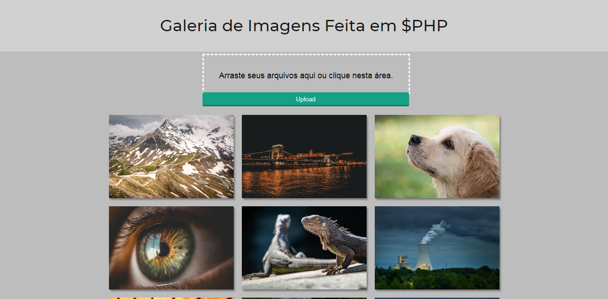

<h1>Simples Galeria de Imagem em PHP</h1>

Antes de começar você precisará ter instalado em sua máquina o seguite:

<ul>
    <a href="https://git-scm.com">Git: https://git-scm.com</a>    
         
</ul>

Você também precisará de um editor de texto como o VSCode ou o PHPStorm

### Rodando o Projeto

<ul>
    <li>Abra o terminal na pasta do projeto.</li>
    <li>Execute "php -S localhost:8080" sem aspas.</li>
    <li>Verifique se a porta 8080 não é usada em outro projeto. </li>
    <li>Caso seja mude a porta no comando acima.</li>
    <li>Você não precisa de banco de dados para este projeto, os arquivos são armazenados localmente.</li>
    <li>Agora é só acessar a url do servidor "localhost:8080" no seu navegador.<3</li>
</ul>

### Tecnologias

As seguintes ferramentas foram usadas na construção do projeto:

<ul>
    <li>HTML</li>
    <li>CSS</li>
    <li>PHP</li>
</ul>

### Autor

<a href="">
 
  
 <b>Carlos Eduardo</b></a>

Feito com ❤️ por Carlos Eduardo

<a href="mailto:carloseduardodiasbatista@gmail.com">Entre em contato</a>

